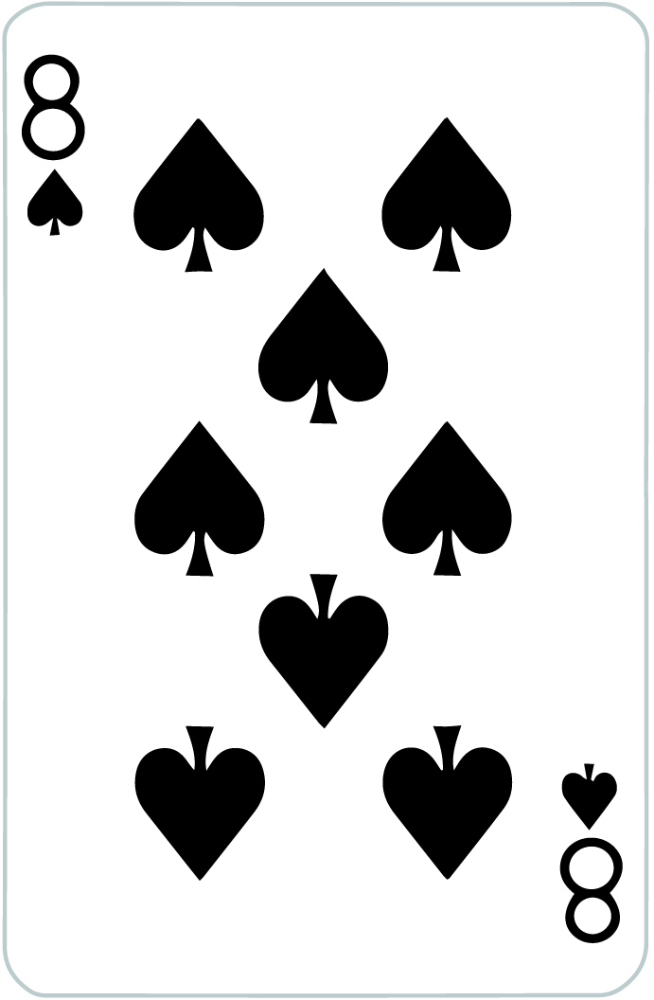

<!DOCTYPE html>
<html>

<head>
    <meta name = "viewport" content = "width = device-width">
    <meta charset="utf-8">
    <link rel="stylesheet" href="style.css">
    
</head>

<body>
  

     

        

            
            {{counter[0]}}
        

        

            
            {{counter[1]}}
        

        

            
            {{counter[2]}}
        

        

            
            {{counter[3]}}
        

        

            
            {{counter[4]}}
        

        

            
            {{counter[5]}}
        

        

            
            {{counter[6]}}
        

        

            
            {{counter[7]}}
        

        

            
            {{counter[8]}}
        

        

            
            {{counter[9]}}
        

        

            
            {{counter[10]}}
        

        

            
            {{counter[11]}}
        

        

            
            {{counter[12]}}
        

        
    

     

     	
     	
        
     

     

        <button id="add" v-on:click="add">Add</button>
        <button id="newGame" v-on:click="newGame">New Game</button>
    

    

        
{{equity}}%

    

   

</body>

</html>
